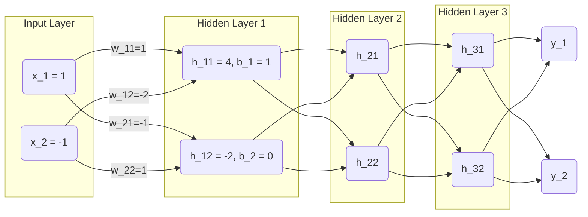
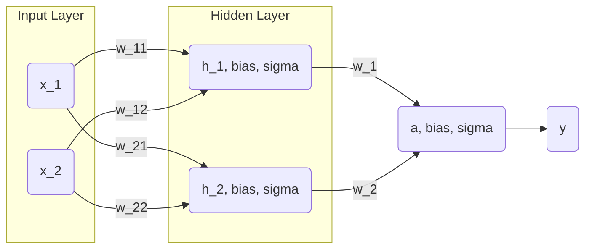

[TOC]

# Week 3: 深度学习补遗：反向传播与逻辑回归

## 摘要

本周内容主要围绕深度学习的数学本质、激活函数、前向传播与反向传播展开。介绍了深度学习的数学本质，介绍引入非线性激活函数对模型表达能力的重要性。通过矩阵形式描述了神经网络的前向传播过程，展示了多层网络的计算结构。详细推导了反向传播算法，阐明了梯度计算和参数更新的数学原理。最后，结合线性代数矩阵表示，系统总结了神经网络训练的整体流程，阐述了梯度下降法及其在多层网络中的的形态。

## Abstract

This week's content primarily revolves around the mathematical essence of deep learning, activation functions, forward propagation, and backpropagation. It introduces the mathematical essence of deep learning and highlights the importance of introducing nonlinear activation functions to enhance the model's expressive power. The forward propagation process of neural networks is described in matrix form, illustrating the computational structure of multi-layer networks. The backpropagation algorithm is derived in detail, elucidating the mathematical principles of gradient computation and parameter updating. Finally, combined with linear algebra matrix representation, the overall process of neural network training is systematically summarized, and the gradient descent method and its forms in multi-layer networks are elaborated.

## 1  深度学习

### 1.1 数学本质

深度学习的本质实际上还是基本的数学运算的叠加。借用[李宏毅](https://www.youtube.com/@HungyiLeeNTU)老师的例子：期望对视频浏览量进行预测，假设有**当日浏览量**输入$x$，**第二天浏览量**作为目标输出$y$，希望有一个函数$f(x)$对其的关系进行拟合。可以假设其关系是线性的。
$$
\begin{equation}
y=wx+b
\end{equation}
$$
就可以尝试用线性回归的方法求得$w$和$b$的估计值。但线性的关系对于实际问题往往太过简单，而线性关系的组合仍然是线性的关系，就要考虑给其引入非线性。

### 1.2 激活函数

$Sigmoid$函数是一个在生物学中常见的S型函数，也称为S型生长曲线。在信息科学中，由于其单增以及反函数单增等性质，$Sigmoid$函数常被用作神经网络的激活函数，变量映射到$[0,1]$之间。
$$
\sigma(x) = \frac {1} {1+e^{-x}}
$$
其导数为$\sigma'(x)=\frac{e^{-x}}{(1+e^{-x})^2}=\sigma(x)(1-\sigma(x))$ 。

因此，$y$与$x$之间的关系可以改写为$y=cSigmoid(wx+b)$，通过$c$、$w$、$b$的更改来调整$Sigmoid$函数的形状，并通过多段$Sigmoid$的组合拟合原函数。通过使用激活函数$Sigmoid$引入非线性，使神经网络能建模复杂的关系。

### 1.3 矩阵表示与前向传播

有时输入并不是单特征，我们将输入$x$看做是一个输入向量$\mathbf{x}=\begin{bmatrix} x_1 \\ x_2 \\ ... \\ x_n \end{bmatrix}$，就可以把其转化为线性代数中的矩阵运算。$z = \sum_{i=1}^n w_i x_i + b = \mathbf{w}^T \mathbf{x} + b$为各特征的加权和，经过激活函数$Sigmoid$，得到$f(\mathbf{x})=Sigmiod(\mathbf{x})=Sigmoid(\sum_{i=1}^n w_i x_i + b)$，这样就完成了一次前向传播。

一个简单的带三层隐藏层的神经网络可以用如下图表示。

输入层到隐藏层1的数学计算可以表示为：

$$
\begin{bmatrix}
1 & -2\\
-1 & 1\\
\end{bmatrix}
\begin{bmatrix}
1 \\
-1 \\
\end{bmatrix}
+
\begin{bmatrix}
1 \\
0 \\
\end{bmatrix}=
\begin{bmatrix}
4 \\
-2 \\
\end{bmatrix}
$$
其中，$\begin{bmatrix} 1 & -2 \\ -1 & 1 \end{bmatrix}$的第一行是第一个神经元的权重、第二行是第二个神经元的权重，$\begin{bmatrix} 1 \\ 0 \end{bmatrix}$为偏差值Bias，而$\begin{bmatrix} 1 \\ -1 \end{bmatrix}$为输入特征，这个算式实际上为$wx+b$的矩阵表示。每一个神经元实质上还包含了一个激活函数（比如$Sigmoid$），因此实际上一层的运算过程为$f(wx+b)$。

### 1.4 损失函数

在训练过程中，需要有一个标准，用来判断预测结果的好坏，于是引入了损失函数。在Week 2[[Github](https://github.com/dat-G/DeepLearningStudy/blob/main/week%202/Week%202:%20%E6%B7%B1%E5%BA%A6%E5%AD%A6%E4%B9%A0%E8%A1%A5%E9%81%97%EF%BC%9A%E8%AF%84%E4%BB%B7%E6%8C%87%E6%A0%87.md) / [CSDN](https://blog.csdn.net/MCHacker/article/details/148518080)]中，$MSE(y, \hat{y}) = \frac{1}{n}\sum^{n}_{i=1}(y_i-\hat{y_i})^2$和$MAE(y, \hat{y})=\frac{1}{n}\sum^n_{i=1}\left|y_i-\hat{y_i}\right|$可以作为回归任务的损失函数，一般称为$L(y,\hat{y})$，$\hat{y}$为预测值，$y$为真实值。

在回归任务中，$L1loss(y, \hat{y}) = w(\theta)\sum_{i=1}^n |\hat{y}_i - y_i|$， $L2loss(y, \hat{y}) = w(\theta)\sum_{i=1}^n (\hat{y}_i - y_i)^2$，$w(\theta)$为对应真实值的权重。可以注意到$MAE(y, \hat{y})=\frac{1}{n}L1loss(y, \hat{y})$，$MSE(y, \hat{y})=\frac{1}{n}L2loss(y, \hat{y})$，实质上就是对应的未均质化形式。因此$L2loss$和$MSE$类似，更加凸显异常值，放大误差，梯度更加平滑；同时，$L1loss$与$MAE$类似，对异常值不敏感，梯度线性增长。

### 1.5 反向传播

利用损失函数求得损失值后，进行反向传播更新参数，并沿着负梯度方向更新梯度的方法，称为梯度下降法，梯度可以表示为$\frac{\partial L}{\partial \theta}$，即损失函数对反向传播目标变量的偏导数。梯度下降法的本质，是在曲线上随机取一个点，计算其在函数曲线上梯度的值，沿着梯度下降的方向走$\eta\frac{\partial L}{\partial \theta}$，逼近损失函数$L(\theta)$的全局最小值。

反向传播的过程可以表示为：
$$
\begin{equation}
w \gets {}w-\eta\frac{\partial L}{\partial w}
\end{equation}
$$
在几何上来说，梯度就是函数增加变快速度最大的方向，而其反方向，就应当是函数减小速度最快的方向，沿着梯度下降，就能更快找到其最小值。

### 1.6 反向传播的数学演算

对于这样一个简单的单隐藏层的神经网络，使用$MSE$作为损失函数$L(y, \hat{y}) = \frac{1}{2} (y - \hat{y})^2$，$Sigmoid$作为激活函数。

#### 1.6.1 前向传播

易得，隐藏层神经元1的激活后加权和为
$$
\begin{cases}
h_1 = \sigma(w_{11} x_1 + w_{12} x_2 + b_1) \\
h_2 = \sigma(w_{21} x_1 + w_{22} x_2 + b_2)
\end{cases}
$$
输出层为
$$
\hat{y}= \sigma( w_{1} h_1 + w_{2} h_2 + b)
$$
这样就完成了一次前向传播。

#### 1.6.2 反向传播

先求输出$\hat{y}$对权重$w_1$的梯度，根据链式求导法则，$\frac{\partial L}{\partial w_1}=\frac{\partial L}{\partial a} \cdot \frac{\partial a}{\partial w_1}$，$a$为输出层$Sigmoid$函数的输入，因此可以求出梯度。
$$
\frac{\partial L}{\partial w_1}=\frac{\partial L}{\partial a} \cdot \frac{\partial a}{\partial w_1}
$$

$$
\frac{\partial L}{\partial a} = \frac{\partial L}{\partial \hat{y}} \cdot \frac{\partial \hat{y}}{\partial a} = - (y - \hat{y}) \cdot \sigma'(a)
$$

可得，$\frac{\partial L}{\partial \hat{y}}=\frac{\partial}{\partial \hat{y}}(\frac{1}{2} (y - \hat{y})^2)=-(y-\hat{y})$，而$\sigma'(x)=\frac{e^{-x}}{(1+e^{-x})^2}=\sigma(x)(1-\sigma(x))=\hat{y}(1-\hat{y})$。

因此，$\frac{\partial L}{\partial a} = - (y - \hat{y}) \cdot \hat{y} \cdot (1 - \hat{y})$，而$\frac{\partial a}{\partial w_1}=\frac{\partial} {\partial w_1}(w_1h_1+w_2h_2+b)=h_1$，即$\frac{\partial L}{\partial w_1} = \frac{\partial L}{\partial a} \cdot \frac{\partial a}{\partial w_1} = - (y - \hat{y}) \cdot \hat{y} \cdot (1 - \hat{y}) \cdot h_1$。同理，$\frac{\partial L}{\partial b} = \frac{\partial L}{\partial a} \cdot \frac{\partial a}{\partial b} = - (y - \hat{y}) \cdot \hat{y} \cdot (1 - \hat{y}) \cdot 1$，可求出对偏置$b$的梯度。

这样就完成了输出层和隐藏层之间的权重以及偏置的梯度求解。

接着求解隐藏层的梯度，先求解损失对隐藏层输出 $h_1$ 的梯度： $\frac{\partial L}{\partial h_1} = \frac{\partial L}{\partial a} \cdot \frac{\partial a}{\partial h_1} = - (y - \hat{y}) \cdot \hat{y} \cdot (1 - \hat{y}) \cdot w_1$；再求解隐藏层激活输入 $ a_1 $ 的梯度： $\frac{\partial L}{\partial a_1} = \frac{\partial L}{\partial h_1} \cdot \frac{\partial h_1}{\partial a_1} = \left[ - (y - \hat{y}) \cdot \hat{y} \cdot (1 - \hat{y}) \cdot w_1 \right] \cdot \sigma'(a_1) = \left[ - (y - \hat{y}) \cdot \hat{y} \cdot (1 - \hat{y}) \cdot w_1 \right] \cdot h_1 \cdot (1 - h_1)$。

最后完成对权重 $w_{11}$和偏置 $b_1$的梯度求解，$\frac{\partial L}{\partial w_{11}} = \frac{\partial L}{\partial a_1} \cdot \frac{\partial a_1}{\partial w_{11}} = \left[ - (y - \hat{y}) \cdot \hat{y} \cdot (1 - \hat{y}) \cdot w_1 \cdot h_1 \cdot (1 - h_1) \right] \cdot x_1$，$\frac{\partial L}{\partial b_1} = \frac{\partial L}{\partial a_1} \cdot \frac{\partial a_1}{\partial b_1} = \left[ - (y - \hat{y}) \cdot \hat{y} \cdot (1 - \hat{y}) \cdot w_1 \cdot h_1 \cdot (1 - h_1) \right]$。

最后还需要完成所有权重与偏置参数的更新，即可完成一次反向传播，其中$\eta$是学习率，学习率需要人工指定，这种需要人工指定的参数被称为**超参数**。
$$
\begin{equation}
w_{ij} \gets w_{ij} - \eta \frac{\partial L}{\partial w_{ij}}, \quad w_i \gets w_i - \eta \frac{\partial L}{\partial w_i}, \quad b_i \gets b_i - \eta \frac{\partial L}{\partial b_i}
\end{equation}
$$

#### 1.6.3 线性代数表示

利用线性代数中的矩阵，这个过程可以被非常简洁的表示出来，正向传播可以有表示如下。

1. 输入层到隐藏层

$$
\mathbf{h}=\begin{bmatrix} h_1 \\ h_2 \end{bmatrix} = \sigma(\mathbf{W}\mathbf{x}+\mathbf{b}) = \sigma(\begin{bmatrix} w_{11} & w_{12} \\ w_{21} & w_{22} \end{bmatrix} \begin{bmatrix} x_1 \\ x_2 \end{bmatrix} + \begin{bmatrix} b_1 \\ b_2 \end{bmatrix}) = \sigma(\begin{bmatrix} w_{11} x_1 + w_{12} x_2 + b_1 \\ w_{21} x_1 + w_{22} x_2 + b_2 \end{bmatrix})
$$

2. 隐藏层到输出层

$$
\begin{equation}
\hat{y}=\sigma(\mathbf{w}^T \mathbf{h} + \mathbf{b}) = [\begin{matrix}w_1 & w_2\end{matrix}] \begin{bmatrix} h_1 \\ h_2 \\\end{bmatrix} = w_1 h_1 + w_2 h_2 + b
\end{equation}
$$

而对于所有的参数$\vec{\theta}=\begin{bmatrix}\theta_1\\\theta_2\\\dots\end{bmatrix}$，进行模型训练的目标是求得令损失函数$L$最小的一组$\theta^*=arg\,\underset{\theta}{\min}()$。首先，需要对$\theta$初始化为随机值，记为$\theta^0$。

进行完正向传播的步骤即需要进行反向传播，求梯度过程如下。
$$
\begin{equation}
\underset{gradient}{\mathbf{g}}=\begin{bmatrix} \left.\frac{\partial L}{\partial \theta_1}\right|_{\theta=\theta^0} \\ \left.\frac{\partial L}{\partial \theta_2}\right|_{\theta=\theta^0} \\ \dots\end{bmatrix}
\end{equation}
$$
也可以写为$\mathbf{g}=\nabla L(\theta^0)$

求得各参数梯度，进行参数更新。
$$
\begin{equation}
\begin{bmatrix}
\theta_1^1 \\
\theta_2^1 \\
\dots
\end{bmatrix}
\gets
\begin{bmatrix}
\theta_1^1 \\
\theta_2^1 \\
\dots
\end{bmatrix}-
\begin{bmatrix}
\eta \left.\frac{\partial L}{\partial \theta_1}\right|_{\theta=\theta^0} \\
\eta \left.\frac{\partial L}{\partial \theta_2}\right|_{\theta=\theta^0} \\
\dots
\end{bmatrix}
\end{equation}
$$
即前述的公式（3），可以写成$\theta^1\gets\theta^0-\eta\mathbf{g}$

每完成一次这样的步骤，就完成了一次训练，即一个**Epoch**。需要做出区分的是，**一个Epoch可以被划分为多个Batch**，而完成了一个Batch就是完成了一次Update，但只有完成了所有的Batch才是完成了一个Epoch。

### 1.7 神经网络

一个在Week 1[[Github](https://github.com/dat-G/DeepLearningStudy/blob/main/week%201/Week%201:%20Python%E7%B1%BB%E4%B8%8E%E7%BB%A7%E6%89%BF%E8%A1%A5%E9%81%97%E4%B8%8EPyTorch%E5%85%A5%E9%97%A8.md) / [CSDN](https://blog.csdn.net/MCHacker/article/details/148365489)]中提到的有$n$层隐藏层的全连接前馈神经网络结构利用线性代数可以表示为：
$$
\vec{y}=f(\vec{x})=\sigma(\mathbf{W}^n\dots\sigma(\mathbf{W}^2(\sigma(\mathbf{W}^1 \vec{x}+\mathbf{b}^1)+\mathbf{b}^2)\dots+\mathbf{b}^n)
$$
利用矩阵的形式表示，能充分利用GPU的并行计算能力，指数级加速运算。···

## 总结

本周参考了李宏毅老师的课程，对深度学习神经网络正向传播与反向传播的过程进行了手推，并利用了Latex和Mermaid进行书写和神经网络图的绘制，复习了神经网络正向传播的原理以及基本的概念，利用手推反向传播的方式夯实了梯度下降的思想以及链式求导法则，同时借助线性代数夯实了对神经网络的理解。